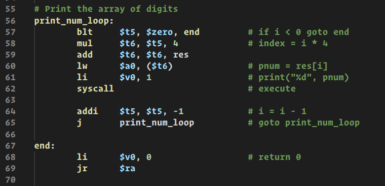
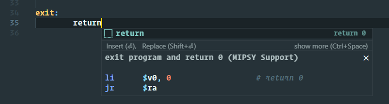

# MIPSY Support

MIPSY Support is a modified version of [vscode-mips-support](https://github.com/kdarkhan/vscode-mips-support) by [kdarkhan](https://github.com/kdarkhan) that adds support for the [mipsy](https://github.com/insou22/mipsy)-specific instructions `push`, `pop`, `begin` and `end`.

It also contains modified and extra snippets designed to better suit using tab indentation with tab width set to 8 spaces.

## Features

### Colours

### Snippets

## TODO

- [x] Add syntax highlighting for mipsy-specific instructions
- [X] Modify snippets to better suit 8-space tab width indentation
- [X] Fix typos in existing snippets
- [X] Add missing comments to existing snippets
- [X] Improve snippet naming
- [X] Add snippets for MIPSY instructions
- [X] Add better syntax highlighting for negative numbers
- [X] Remove syntax highlighting or add warning for instructions not supported by MIPSY
- [ ] Add various snippets
- [ ] Add configuration options for snippet indentation
- [ ] Add configuration options for snippet comments
- [ ] Integrate MIPSY formatter
