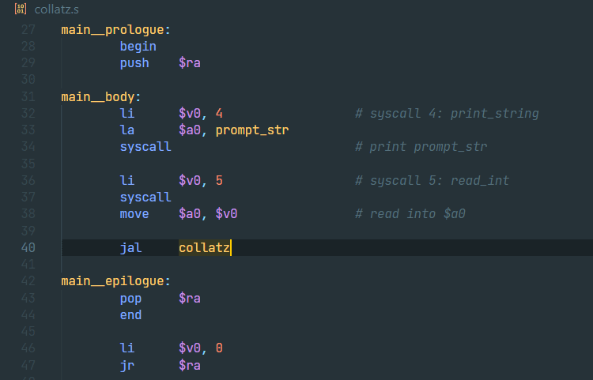

# Mipsy Support
Mipsy Support adds language support for MIPS assembly language, specifically as implemented by [mipsy](https://github.com/insou22/mipsy).

## Features
### Syntax Highlighting
Semantic syntax highlighting only colourizes labels and constants that are defined elsewhere in the document.


### Code Completion
Context-aware code completion for instructions, directives, instructions, labels, and constants.


### Snippets
Snippets with configurable comment indentation for all mipsy-supported syscalls.


### Label & Constant Definitions / References
Support for navigating definitions and usages of labels and constants through visual studio code's UI.


## Recommended Settings
MIPS displays best with 8-space tab indentation, and several features in this extension assume the following settings:
```json
{
    "[mips]": {
        "editor.tabSize": 8,
        "editor.insertSpaces": false
    }
}
```

## Known Issues
- No support for multi-file projects

## Planned Features
- Keybind to automatically indent to comment column

## Building
To contribute to or modify the extension, first clone the repository, install dependencies, and open in vscode:
```
git clone https://github.com/Bahnschrift/vscode-mipsy-support
cd vscode-mipsy-support
npm i
code .
```

Then, inside the vscode editor, press `F5`. This will compile and run the extension in a new Extension Devlopment Host window.

For information on packaging and distributing the extension, see the [vscode docs](https://code.visualstudio.com/api/working-with-extensions/publishing-extension).
